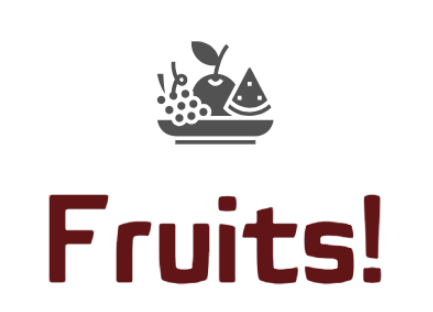

# Projet 8 - OpenClassrooms : DEPLOYEZ UN MODELE DANS LE CLOUD

<u>*Auteur : Maxime SCHRODER*</u>

## Contexte

  

Vous êtes Data Scientist dans une très jeune start-up de l'AgriTech, nommée "Fruits!", qui cherche à proposer des solutions innovantes pour la récolte des fruits. La volonté de l’entreprise est de préserver la biodiversité des fruits en permettant des traitements spécifiques pour chaque espèce de fruits en développant des robots cueilleurs intelligents.

Votre start-up souhaite dans un premier temps se faire connaître en mettant à disposition du grand public une application mobile qui permettrait aux utilisateurs de prendre en photo un fruit et d'obtenir des informations sur ce fruit.

Pour la start-up, cette application permettrait de sensibiliser le grand public à la biodiversité des fruits et de mettre en place une première version du moteur de classification des images de fruits.

De plus, le développement de l’application mobile permettra de construire une première version de l'architecture Big Data nécessaire.

## Données

Les données proviennent du Kaggle suivant : https://www.kaggle.com/datasets/moltean/fruits

## Mission 
1. S'approprier les travaux réalisés par un alternant ([lien notebook](https://s3.eu-west-1.amazonaws.com/course.oc-static.com/projects/Data_Scientist_P8/Mode_opératoire.zip))
2. Compléter la chaîne de traitement (notamment mise en place d'une réduction dimensionnelle des features)

EN RESUME: Mettre en place les premières briques nécessaires de traitement permettant le passage à l’échelle en termes de volume de données !

## Construction

Dans ce dépôt, vous trouverez :
1. Le notebook jupyter réalisé sur AWS via JupyterHub: Notebook_cloud.ipynb.
2. Le fichier de résultats sous format csv: df_results_cloud.csv.
3. Le support de présentation : Présentation.pdf
4. Le notebook jupyter de test local : Notebook_test_local.ipynb.
5. Le fichier de boostrap, pour l'installation des dépendances nécessaires sur chaque noeud du cluster EMR : bootstrap-emr.sh
6. Le logo de la société : logo_fruits.png
7. Le dossier img_cloud contenant 5 images de 10 fruits/légumes différents, pour la démonstration dans le cloud
8. Le fichier contenant les dépendances nécessaire pour l'environnement local : local_requirements.txt